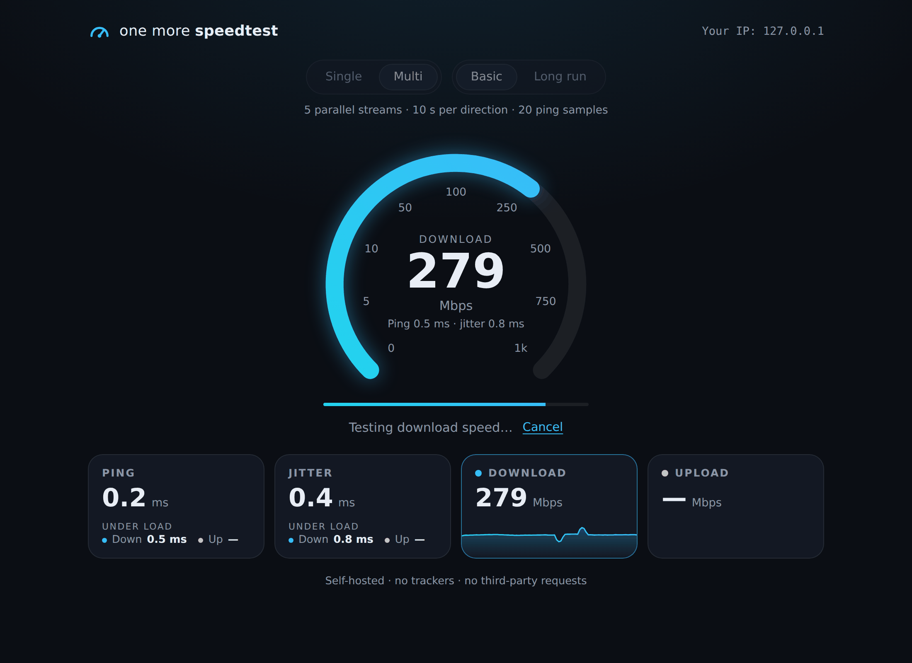
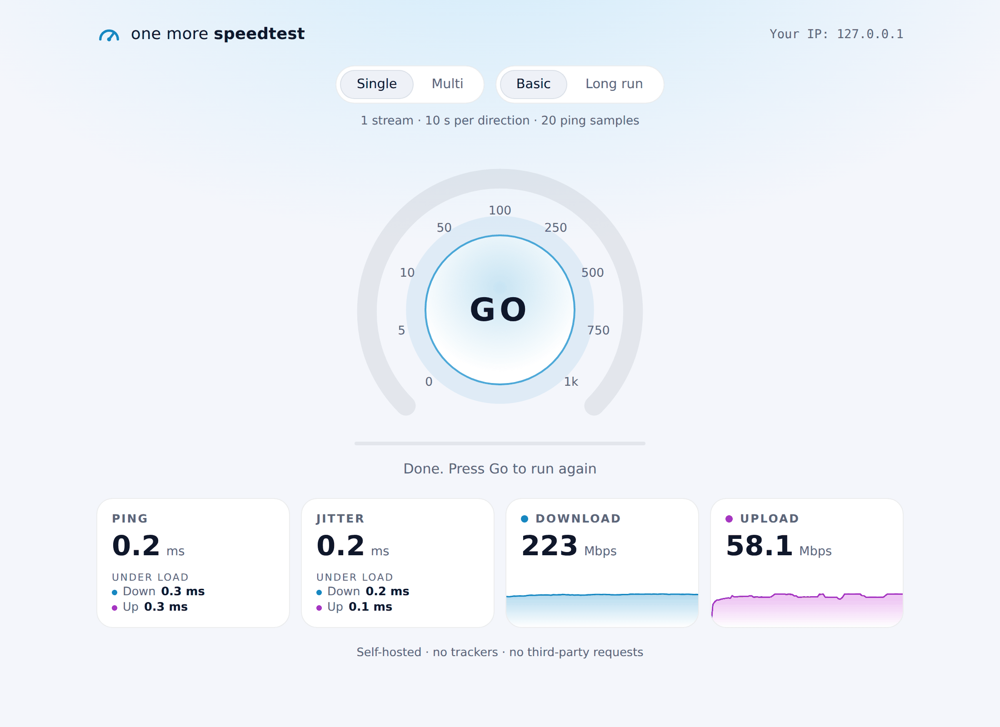

# one-more-speedtest

[](https://github.com/Tomansru/one-more-speedtest/actions/workflows/ci.yml)
[](https://github.com/Tomansru/one-more-speedtest/pkgs/container/one-more-speedtest)

A simple, self-hosted internet speed test. One static Go binary, no third-party
dependencies: the backend uses only the Go standard library and the UI is plain
HTML, CSS and JavaScript embedded into the binary.

It measures:

- **Ping** – median round-trip time of small HTTP requests (after a warm-up request).
- **Jitter** – mean absolute difference between consecutive ping samples.
- **Download** and **Upload** throughput in Mbps.
- **Ping and jitter under load** – the same latency probe keeps running (every
  200 ms) while the download and the upload saturate the link. Comparing it with
  the idle ping shows how much your connection suffers from
  [bufferbloat](https://www.bufferbloat.net/projects/bloat/wiki/Introduction/).

At the end a results card is shown that can be **downloaded as a PNG** or
**copied to the clipboard** as an image.

<p align="center">
  <a href="docs/screenshots/test-dark.png"></a>
  <a href="docs/screenshots/finished-light.png"></a>
</p>

## Stability monitor

A second page, `/monitor` (linked quietly from the footer of the main page),
runs an endless latency test. Start it, leave the tab in the background while
you play or work, and come back to see how stable the connection was:

- **Drops** – two or more lost pings in a row, with their start, length and
  total downtime / uptime share.
- **Lost pings** – no reply within 2 s, or a network error; packet loss in %.
- **Latency spikes** – replies more than twice the median and at least 50 ms
  above it.
- **Ping** – min / max / average / median / P95 / P99 over the whole session.
- **Jitter** – current value over the last 10 s, its calmest and worst 10 s,
  the session average and the largest single jump.
- A timeline of ping and jitter (1 min, 10 min, 1 h or the whole session),
  an event log and a CSV export of every sample.

The probe runs in a Web Worker, so it keeps its pace (250 ms, 500 ms or 1 s)
while the tab is hidden; the tab title shows the current status (🟢 / 🟡 / 🔴).
Time the computer spends asleep is marked as paused and not counted as
downtime.

## Test modes

| Setting      | Option    | What it does                                  |
|--------------|-----------|-----------------------------------------------|
| Connections  | Single    | 1 HTTP stream per direction                    |
|              | Multi     | 5 parallel HTTP streams per direction          |
| Duration     | Basic run | 20 ping samples, 10 s download, 10 s upload    |
|              | Long run  | 50 ping samples, 30 s download, 30 s upload    |

The first seconds of each transfer phase (1.5 s for a basic run, 3 s for a long
run) are a warm-up for TCP slow start and are excluded from the final speed and
from the loaded latency.

Browsers open at most 6 HTTP/1.1 connections per host, so multi mode uses 5
transfer streams and keeps one connection free for the latency probe.

## Running

Requires Go 1.27+.

```sh
go run .
# open http://localhost:8080
```

Or build a binary:

```sh
go build -o speedtest .
./speedtest -addr :8080
```

Or with Docker, using the image from GitHub Container Registry (`linux/amd64`
and `linux/arm64`):

```sh
docker run --rm -p 8080:8080 ghcr.io/tomansru/one-more-speedtest:latest
```

| Tag                          | Built from                          |
|------------------------------|-------------------------------------|
| `latest`, `1`, `1.2`, `1.2.3` | Release tags like `v1.2.3`          |
| `dev-latest`, `sha-<commit>` | Every push to `main`                |

Pull requests only build the image to check it, without publishing it.

To build it yourself:

```sh
docker build -t one-more-speedtest .
docker run --rm -p 8080:8080 one-more-speedtest
```

### Options

| Flag           | Environment variable        | Default | Description                                                     |
|----------------|-----------------------------|---------|-----------------------------------------------------------------|
| `-addr`        | `SPEEDTEST_ADDR`            | `:8080` | Listen address                                                  |
| `-trust-proxy` | `SPEEDTEST_TRUST_PROXY=1`   | off     | Report the client IP from `X-Forwarded-For` / `X-Real-IP`       |

Enable `-trust-proxy` only when the server runs behind a reverse proxy you
control. If you put a proxy in front, make sure it does not buffer or compress
`/api/download` and `/api/upload`, otherwise results will be wrong.

Copying the result image to the clipboard requires a secure context (HTTPS or
`localhost`); downloading the image works everywhere.

## API

| Method | Path                       | Description                                         |
|--------|----------------------------|-----------------------------------------------------|
| GET    | `/api/ping`                | Empty `204` response for latency measurement        |
| GET    | `/api/download?size=BYTES` | Streams incompressible random data (max 1 GiB)      |
| POST   | `/api/upload`              | Reads and discards the body (max 256 MiB), returns `{"bytes": N}` |
| GET    | `/api/info`                | Returns `{"ip": "..."}` as seen by the server       |

## Development

```sh
go vet ./...
go test ./...
```

## License

MIT
